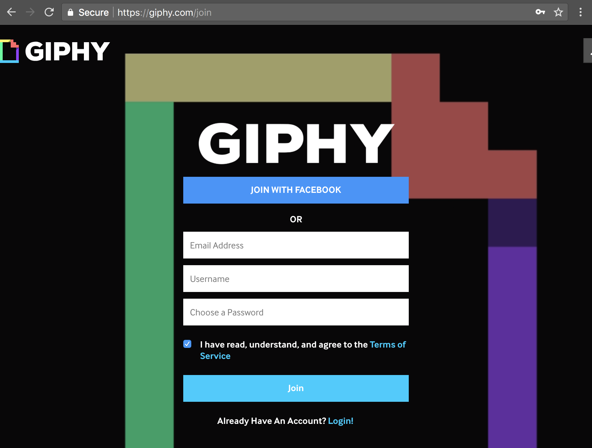
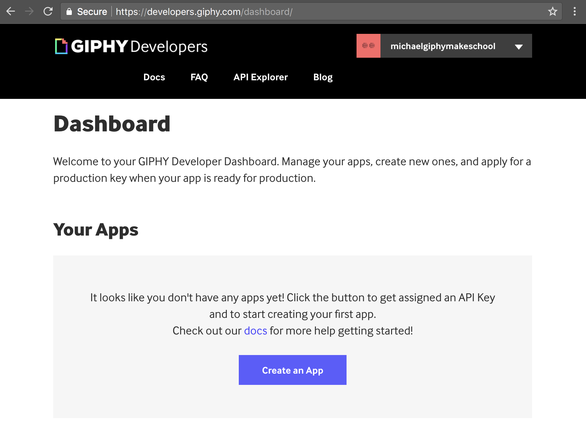
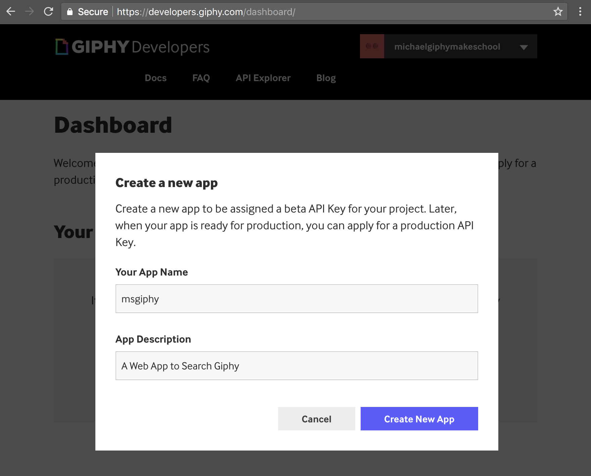
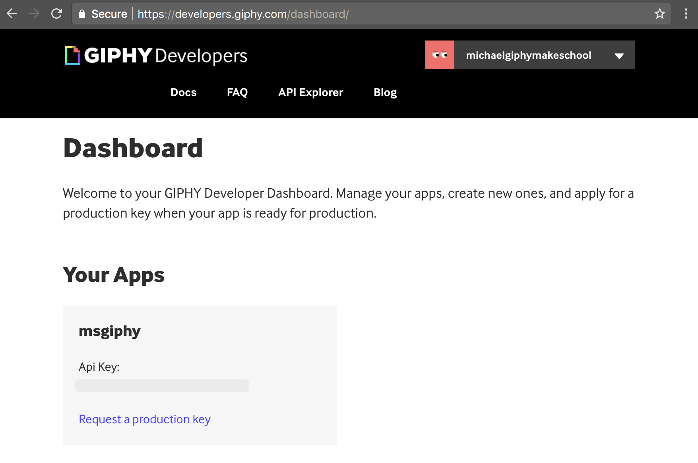
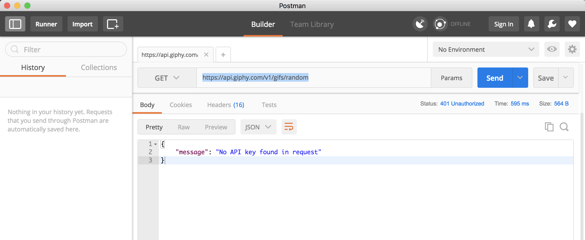
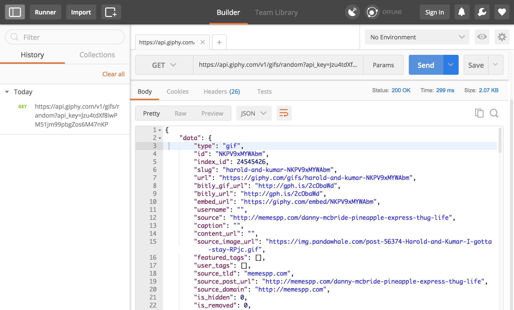

In this section, we will:

- Learn what an API is and why we would want to use one
- Learn about JSON
- Access APIs using Postman

# What is an API?

If you want your app to connect to servers owned by other people, then you are going to have to deal with *APIs* (Application Program Interfaces). In general, an API is just a standard way for some piece of software to talk to another piece of software. But in web development, _API_ usually refers to a server connected to the internet that returns raw data instead of nicely formatted HTML pages. For example, you may use an [API for getting weather information](http://openweathermap.org/api), an [API for detecting faces](http://www.faceplusplus.com/api-overview/) or one of [thousands of others](https://market.mashape.com/explore?sort=developers).

# JSON

JSON–_Javascript Object Notation_–is an extremely common format for web APIs. Remember that a Javascript object, denoted by `{ }`, is a collection of key-value pairs, for example `{ name: 'Joe', age: 23 }`. JSON is a way of representing a Javascript object as simple text–this is useful because it's really easy to send text over the internet. So in JSON, `{ name: 'Joe', age: 23 }` becomes `'{"name":"Joe","age":23}'`.

It's important to understand that a JSON string is not _exactly_ the same as a Javascript object–Javascript objects are much more powerful, and can contain functions and complex data types. The strength of JSON is its simplicity: the only data types allowed are `String`s and `Number`s.  Nested `Object`s and `Array`s are also allowed, but they too can only contain `String`s and `Number`s.

Recall that an `Array`, denoted with `[ ]`, is a simple collection of items. Here's an array of animals: `["dog", "cat", "horse", "caterpillar"]`. Here's an array of numbers: `[42, 2001, 1984, 867.5309, 3.14]`.

JSON is built into Javascript, so it's really easy to work with. If you have a Javascript `Object` or `Array` and you want a JSON-formatted `String`, call `JSON.stringify()`. For example:

```Javascript
myObject = { name: 'Joe', age: 23 }
> { name: 'Joe', age: 23 }

JSON.stringify(myObject)
> '{"name":"Joe","age":23}'

myArray = ["dog", "cat", "horse", "caterpillar"]
> [ 'dog', 'cat', 'horse', 'caterpillar' ]

JSON.stringify(myArray)
> '["dog","cat","horse","caterpillar"]'
```

But remember–a JSON string is _not_ an `Object` or an `Array`. It's a `String`. Observe:

```Javascript
myObject = { name: "Sue", age: 21 }
> { name: 'Sue', age: 21 }

myObject.name
> 'Sue'

myJsonString = JSON.stringify(myObject)
> '{"name":"Sue","age":21}'

myJsonString.name
> undefined
```

`myObject` has a `.name` property, but `myJsonString` does not because it is a `String`, and `String`s don't have a `.name` property.
Very often, the response you'll get from a server is formatted in *JSON* (JavaScript Object Notation). This sounds like a whole lot of work, but luckily, other programers have written libraries to make our life a whole lot easier!

## Example JSON content

Here's an example JSON response received from `http://api.randomuser.me/` -- a testing API for generating fake user data (formatted and indented to show the structure):

```
"{
  "results" : [
    {
      "email" : "rose.moore@example.com",
      "gender" : "female",
      "name" : {
        "title" : "mrs",
        "first" : "rose",
        "last" : "moore"
      }
      "nat" : "NZ",
      "cell" : "(302)-922-2080",
      "phone" : "(091)-223-5617",
      "login" : {
        "username" : "goldenmouse616",
        "password" : "shaker",
        "sha256" : "a53a4df8d7798149e6b75f652d246d0569d5d40c5bf41cff17befd540cee0cc4",
        "sha1" : "49ec83c662c0b0327d1eadec2bf006b93310d601",
        "salt" : "mTw9b4M6",
        "md5" : "a6bac151418455b103a126cfe0529416"
      },
      "registered" : 1109275261,
      "dob" : 401570145,
      "picture" : {
        "large" : "https://randomuser.me/api/portraits/women/84.jpg",
        "thumbnail" : "https://randomuser.me/api/portraits/thumb/women/84.jpg",
        "medium" : "https://randomuser.me/api/portraits/med/women/84.jpg"
      },
      "location" : {
        "state" : "wellington",
        "street" : "3992 north street",
        "city" : "masterton",
        "postcode" : 67068
      },
    }
  ],
  "info" : {
    "version" : "1.0",
    "results" : 1,
    "seed" : "536aa150a38f4a9b",
    "page" : 1
  }
}"
```

There is an `Object` at the base with two keys: `"results"` and `"info"`. All the stuff we want is in `"results"`, which contains an array of more objects. In this case, there is only one object in the array because we only requested one random user. If we had requested more random users, there would have been multiple objects (each containing information about a new random user) inside of the results array.

The dictionary has keys of `"gender"`, `"name"`, `"location"`, `"email"`, `"login"`, and a few more! `"gender"` contains a `String` value of `"female"`, while other keys like `"name"` contain another `Object` with `"title"`, `"first"`, and `"last"` keys. Are you starting to see the pattern?

Now, how can we actually use this data?

# Postman

Before we start writing code to access APIs, lets get more familiar with making HTTP requests and reading the JSON responses. We'll use  (Postman)[https://www.getpostman.com/], a tool that provides a graphic interface to work with APIs. It's possible to do everything in the terminal, but Postman makes it much more convenient.

>[action]
>

>
Go to [https://www.getpostman.com/] and click on "Download the App", then follow the directions to install it in your `Applications` folder. If you get an error message about opening apps from unidentified developers, you may need to open System Preferences and go to Security & Privacy to set permissions. It will ask you to create an account, but this isn't necessary–you can just click "Skip for now".

# Some public APIs

Let's start by making the simplest API call possible–a GET request with no options. The JSON example above, from `http://api.randomuser.me/`, is perfect.

>[action]
>
In Postman, set the button on the left to "GET", enter `http://api.randomuser.me/` in the address bar, and click "Send".
>

>
Take a moment to read through the response–it's the same as the example JSON object above.

`http://api.randomuser.me/` is great because it's _so_ easy to use, but as you use more powerful and complex APIs you'll have to start adding options and configuration. One of the most common steps you'll have to take is _authentication_, or providing account information. There are a ton of different ways to authenticate an API call, and there's no hope of covering them all in one lesson. Our goal in this tutorial is to consume the Giphy API, and it authenticates using an _API key_, which happens to be a very common and simple authentication scheme. This makes it a great place to start.

>[action]
>
If you don't have a Giphy account, you can create one for free at (https://giphy.com/join).
>


<!--  -->

>[action]
>
After you've signed up/logged in, go to your dashboard at (https://developers.giphy.com/dashboard/).
>

>
And click on "Create an App".
>

>
Fill in the fields to give your app a name and description, as above, and click "Create New App".
>

>
And then copy that API Key–we'll need it to make calls to the Giphy API.

## Make Calls to the Giphy API

With our API Key in hand, we're ready to try out Giphy's API. You can skim through the documentation at (https://developers.giphy.com/docs/)–we'll start with the simplest endpoint, which takes no options and returns a single random GIF.

>[action]
>
Open Postman. Enter `https://api.giphy.com/v1/gifs/random` into the URL field, and make sure the button to the left is set to 'GET'.
>

>
Click `GET` and you should see something like the above–we have our API Key, but we need to send it with our GET request.
>
In the URL field, add `?api_key=` to the end of the URL, followed by your Giphy API key, as below:
>



# Summary

In this section, we learned how to access APIs using Postman, which is a popular development tool. In the next section, we'll start building an application that can access an API for us.
