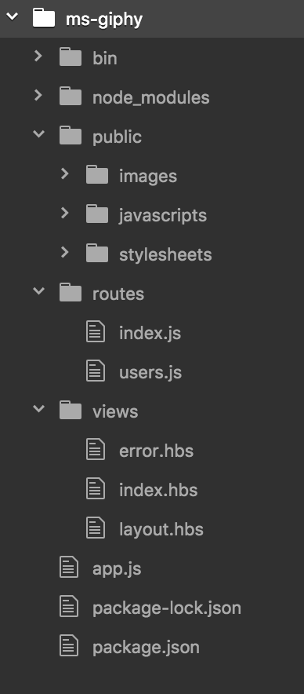
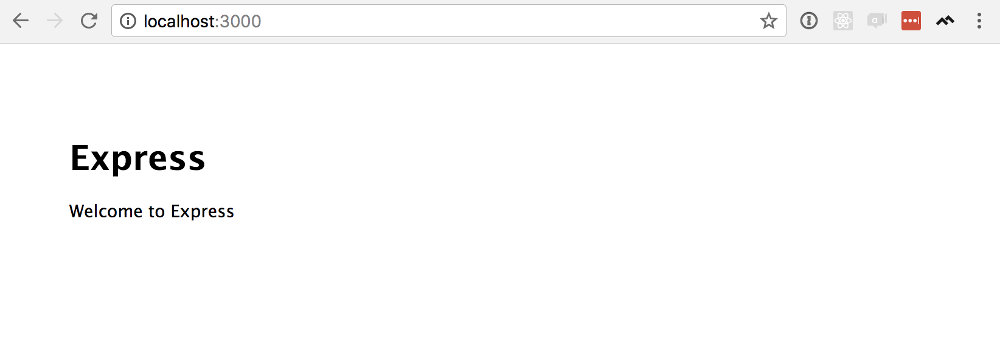
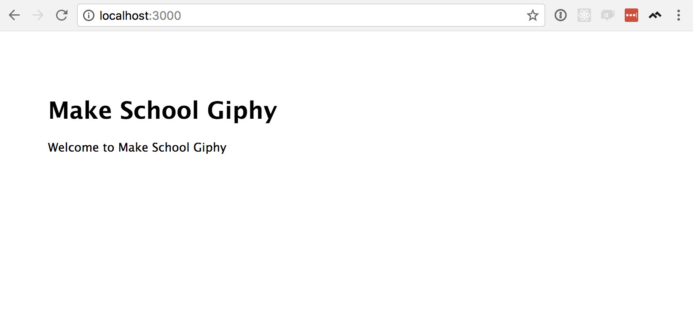
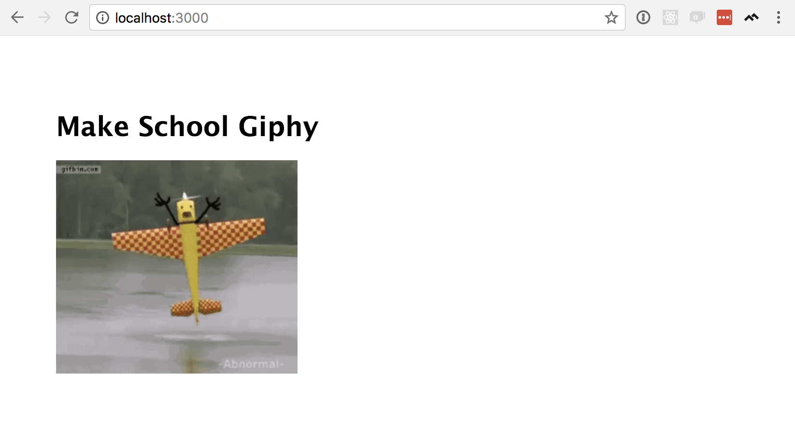
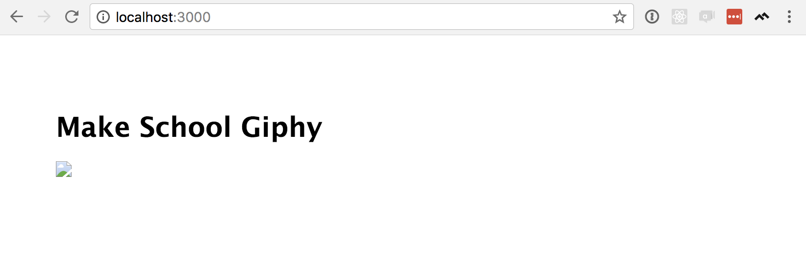
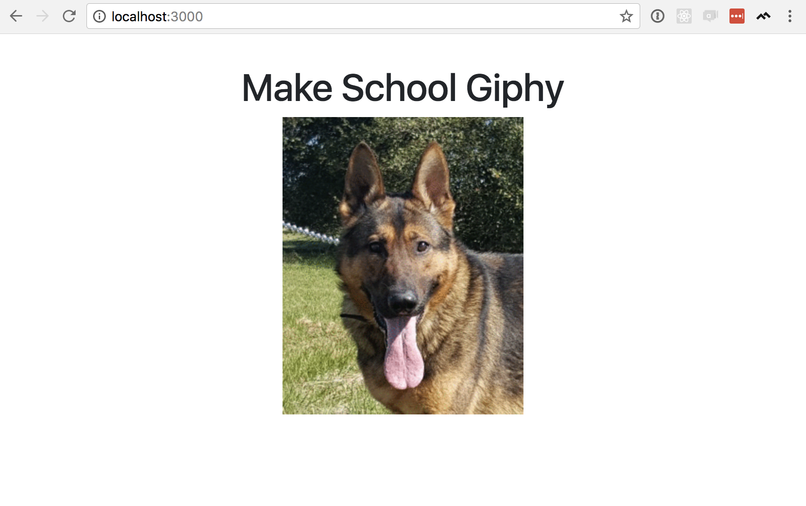

<!-- TODO:Introduction -->

## Setting Up Our Environment

<!-- TODO: consider creating a starter repo, and having students pull that down instead of going through following steps -->

<!-- ## Install Node and NPM -->
<!-- This tutorial should assume that students have already installed Node and NPM (and Express) -->

## Generate Template

Express can generate most of the files we need to build our app automatically if we install the `Express Generator`.

>[action]
>
In your terminal, type:
>
```
npm install express-generator -g
```

After the package finishes installing, we can generate a _skeleton_ for our app.

>[action]
>
In the terminal, enter:
>
```
express --hbs ms-giphy
```

There should be a new `ms-giphy` folder–you can type `ls` to see the contents of your current directory. Let's open that folder by typing `cd ms-giphy`.

>[action]
>
Inside the `ms-giphy` folder, tell NPM to install the packages our app needs by running
>
```
NPM install
```

## Add Extra Packages

We'll install two more packages before we move on–an _HTTP client_, and a development tool. In a previous section we used Postman to make HTTP requests, and an _HTTP client_ will let us do the same thing with code. Javascript actually has a built in HTTP client, but it's not very easy to work with, and as a result there are a bunch of popular HTTP packages on NPM. We'll use a package called [Request](https://github.com/request/request).

The other package we'll install is called [Nodemon](https://nodemon.io/) (short for _Node Monitor_). Any time we save changes to any of our files, Nodemon will restart the server for us automatically–this is a _massive_ convenience during development.

>[action]
>
To install Request and Nodemon, enter the following into the terminal:
>
```
npm install request nodemon --save
```

Now we're ready to build an app that calls the Giphy API.

# Getting a Random GIF

Our first goal is to build an _MVP_–a _Minimum Viable Product_, or the simplest possible version of our app. In this case, our _MVP_ will be a single call to Giphy's random API endpoint, and a simple web page that displays the .gif it returns. Let's start by building the API call.

## Use Request to Call Giphy Random API

Let's open the `ms-giphy` directory in your text editor. You should have these files:



Open `routes/index.js`, and you should see the following code:

```Javascript
var express = require('express');
var router = express.Router();

/* GET home page. */
router.get('/', function(req, res, next) {
  res.render('index', { title: 'Express' });
});

module.exports = router;
```

Express has defined one route for us already at `/`, which is the root route of our web site-when somebody visits `www.my-awesome-site.com` (or `localhost:3000`, as we'll do in a moment), this is the function we'll call. At the moment, all it does is return a file called `index` with a title "Express"–we'll see what all this means in the next section. For now, let's set this function up to use Request

>[action]
>
```Javascript
const express = require('express');
const router = express.Router();
>
// Add this line
const request = require('request');
>
/* GET home page. */
router.get('/', function(req, res, next) {
>
  // Add the following 5 lines (be sure to add _your_ API key to the URL)
  const url = "http://api.giphy.com/v1/gifs/random?api_key=YOUR-API-KEY";
  request.get(url, (err, response, body) => {
    if(err) { console.error(err) }
>
    body = JSON.parse(body);
    console.log(body);
>
    res.render('index', { title: 'Express' });
  });
});
>
module.exports = router;
```
>
First, we are requiring Request and assigning it to the variable `request`–now we can access all of Request's functionality through that variable.
>
Next, we save the Giphy API Random Endpoint URL as a variable–this isn't totally necessary, but it makes it look a little nicer on the next line when we have to pass it in to `.get()` as an argument. Also, be sure to replace `YOUR-API-KEY` with _your API key_–otherwise you'll just get `422` errors instead of gifs.
>
Finally, we parse the `body` to convert it from a JSON string to a Javascript object, and log that to the console. (Here, `console.log()` will print messages in your terminal because this code runs on the server; if you run `console.log()` from inside a browser, it will print to your browser console).

Let's try it out: in your terminal, make sure you're in your `ms-giphy` folder and type:

```
nodemon start
```

If you don't see an error message, open your browser and visit `localhost:3000`. You should see the default Express home page, something like this:



This is because we haven't set this page up yet–we'll do that next. But if you look at the terminal, you should see a couple of `GET` request logs and a rather large object with keys like `slug`, `url`, `bitly-url`, etc... If so, we're ready to display that result on a web page.

If you see `{ message: 'Invalid authentication credentials' }` instead, check your API key in the URL.

## Load result into view

At this point, when we visit the home page of our app we don't see anything interesting–but on the back end, we're making a call to the Giphy API and getting a random .gif. Let's display that back end work on a page.

Take another look at `routes/index.js`, especially the `res.render()` line:

```Javascript
res.render('index', { title: 'Express' });
```

This says that when someone hits our root route, `/`, we'll _render_ a file called `'index'`. That file happens to be located at `views/index.hbs`, so let's look at that file:

```HTML
<h1>{{title}}</h1>
<p>Welcome to {{title}}</p>
```

Notice the double-brace notation (`{{...}}`)–that's _Handlebars_. Here, Handlebars expects a variable called `title`, which we assign in our `routes/index.js`. Go back to that file, and in `res.render()`, let's change the title to something other than `'Express'`, like `'Make School Giphy'`:

```Javascript
res.render('index', { title: 'Make School Giphy' });
```

Then, if you refresh `localhost:3000` in your browser, you should see this:



Now that we can control what appears on our home page from the back end, let's display our .gif.

>[action]
>
Update `views/index.hbs` to look like the following:
>
```HTML
<h1>{{title}}</h1>
<p>
  
</p>
```
>
Here, we're adding an `img` tag onto the page, but instead of a URL we have Handlebars tag that renders a variable `imgUrl`. Just like our `title` variable, we need to give it a value in `routes/index.js`.

>[action]
>
Open `routes/index.js`, and update the `res.render()` line to include a value for `imgUrl`:
>
```Javascript
const express = require('express');
const router = express.Router();
const request = require('request');
>
/* GET home page. */
router.get('/', function(req, res, next) {
  const url = "http://api.giphy.com/v1/gifs/random?api_key=YOUR-API-KEY";
  request.get(url, (err, response, body) => {
    if(err) { console.error(err) }
>
    body = JSON.parse(body);
>
    // Add this line to get the .gif's URL from the Giphy response body:
    const imgUrl = body.data.image_url
>
    // And pass it to our view as imgUrl:
    res.render('index', { title: 'Make School Giphy', imgUrl: imgUrl });
  });
});
>
module.exports = router;
```

Now refresh 'localhost:3000' again, and you should see a random .gif:



If you see a broken image icon instead of a .gif, try refreshing the page–our app is still very simple and lacks error handling, and some .gifs only work in specific situations.



## Add CSS

One last step before we finish our _MVP_, let's add some styling. We won't spend a lot of time making our app beautiful, but it's easy to make it look pretty good really fast. [Bootstrap](https://getbootstrap.com/) is a popular front end framework, and it's very easy to set up in three steps: First, we'll include Bootstrap in our project; Second, we'll add some Bootstrap classes to our HTML; Third, we'll add some custom CSS.

>[action]
>
Start by opening the `views/layout.hbs`, and add the line indicated below:
>
```HTML
<!DOCTYPE html>
<html>
  <head>
    <title>{{title}}</title>
>
    <!-- Add the following 3 tags: -->
    <link rel="stylesheet" href="https://maxcdn.bootstrapcdn.com/bootstrap/4.0.0/css/bootstrap.min.css" integrity="sha384-Gn5384xqQ1aoWXA+058RXPxPg6fy4IWvTNh0E263XmFcJlSAwiGgFAW/dAiS6JXm" crossorigin="anonymous">
    <meta charset="utf-8">
    <meta name="viewport" content="width=device-width, initial-scale=1, shrink-to-fit=no">
>
    <link rel='stylesheet' href='/stylesheets/style.css' />
  </head>
>
  <body class="container-fluid text-center">
>
  <!-- Wrap the Handlebars output inside a <main> tag -->
    <main class="container-fluid text-center">
      {{{body}}}
    </main>
  </body>
</html>
```
>
This will download CSS files from a Bootstrap server instead of our own server, which means we don't have to do anything else to set it up–we're ready to start using it.

>[action]
>
Next, go back to `views/index.hbs`, and update your HTML to match the following:
>
```HTML
<div class="row">
  <div class="col-xl">
    <h1>{{title}}</h1>
  </div>
</div>
>
<div class="row">
  <div class="col-xl">
    
  </div>
</div>
```
>
Adding these classes and laying out our divs this way lets us take advantage of Bootstrap.

>[action]
>
Finally, let's take care of some custom CSS. Open the file `public/stylesheets/style.css`. Delete everything inside, and add the following:
>
```CSS
body, html {
  padding: 0;
}
>
main {
  padding: 2em;
}
```

Now if you refresh `localhost:3000`, you should see something like the following:



Congratulations, we completed our MVP! Our app fulfills a basic function–fetching a random gif from the Giphy API–and it doesn't do _anything_ else. Let's add a search feature.
