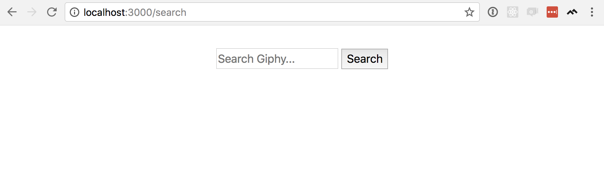
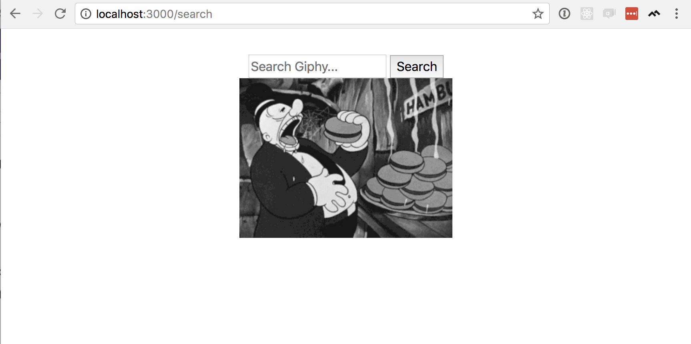
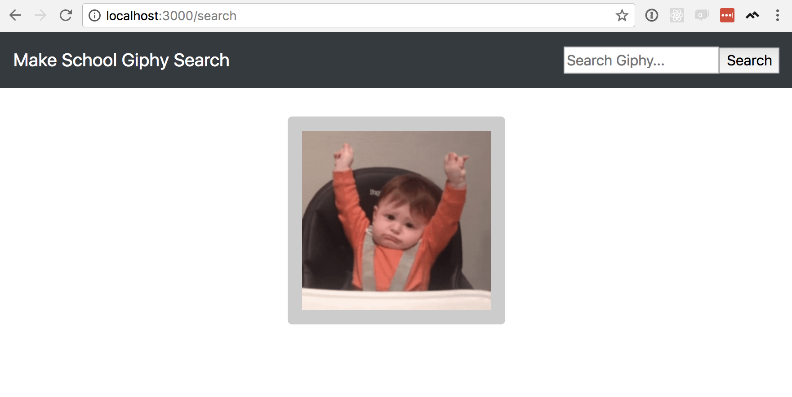

In this section we will:

- Implement a .gif search feature for Giphy
- Send query data with a POST request
- Use Bootstrap to style our app

# Giphy Search

So far, when a user visits our app, we make a call to Giphy's `/random` API endpoint and display the result to the user. It's very simple, but it isn't interactive at all (beyond letting the user refresh the page....) Our search feature will take input from the user–what kind of .gif do they want?–which means we have to get that input and handle it appropriately.

We'll add our search feature in three steps.  First, we'll create a search form where the user can enter their input. Next, we'll set up the server to handle the input from that form–that includes accepting the user's input, and making a call to Giphy's `/search` API endpoint. Finally, we'll display the results to the user.

## Giphy Search Form

>[action]
>
Create a new file in your `views` folder called `search.hbs`. Add the following code:
>
```HTML
<form action="/search" method="POST">
  <input type="text" name="giphy-query" placeholder="Search Giphy..." />
  <input type="submit" value="Search" />
</form>
```

In order to render that form, we need to set up an endpoint at `/search`.

>[action]
>
Open the `routes/index.js` file and add a GET route for `/search`, as below:
>
```Javascript
const express = require('express');
const router = express.Router();
const request = require('request');
>
router.get('/', (req, res, next) => {
  const url = "http://api.giphy.com/v1/gifs/random?api_key=7eJ7JRkWzxL5X7b1BqsjkOr28hX3rgDe";
  request.get(url, (err, response, body) => {
    if(err) { console.error(err) }
>
    body = JSON.parse(body);
    const imgUrl = body.data.source_image_url
>
    res.render('index', { title: 'Make School Giphy', imgUrl: imgUrl });
  });
});
>
// Add the following 3 lines:
router.get('/search', (req, res, next) => {
  res.render('search');
})
>
module.exports = router;
```
>
This action looks for a file called `'search'` in our `views/` folder–which we just created–and renders that file for the user.

Let's try it out by going to `localhost:3000/search` in your browser. You should see something like this:



## Giphy Search API

Now let's handle the user's input. Take another look at the first line of `views/search.hbs`:

```HTML
<form action="/search" method="POST">
```

What happens when a user submits this form? The browser sends a POST request with all the form data to the URL specified in `action`–in this case, `/search`. Let's define an endpoint to handle POST requests to `/search`.

>[action]
>
Open the `routes/index.js` file, and add the following router action:
>
```Javascript
router.post('/search', (req, res, next) => {
  console.log(req.body);
  res.status(204).send({});
});
```
>
The body of the HTTP request (`req.body`) contains the contents of the user's form, and we want to print them to the server terminal to make sure it works. Then we return an empty object just to close the request-response cycle.

In your browser, go to `localhost:3000/search`. Enter a search term, click the 'Search' button, and... hopefully nothing happens–That's what we expect. But look at the server logs in your terminal, and the second line from the bottom should be

```
{ 'giphy-query': 'YOUR SEARCH QUERY' }
```

That confirms that we can get the input from the user, but the trick here is relaying that search to the Giphy API. If you need a refresher on how the Giphy `/search` endpoint works, [you can check out the docs here](https://developers.giphy.com/docs/#operation--gifs-search-get).

<!-- TODO: point out that we're sending a GET request, not POST, and add info box about the two ways to send params (POST body or URL query params). Also explain why param is called 'giphy-query' and where defined -->

>[action]
>
In `routers/index.js`, update the `POST /search` action to the following:
>
```Javascript
router.post('/search', (req, res, next) => {
  const query = req.body['giphy-query']
  const url = `http://api.giphy.com/v1/gifs/search?api_key=YOUR-API-KEY&q=${query}`;
>
  request.get(url, (err, response, body) => {
    if(err) { console.error(err) }
>
    body = JSON.parse(body);
    console.log(body);
>
    res.status(204).send({});
  });
});
```
>
Unlike our request to `/random`, the URL we use to connect to the Giphy API will be different depending on the user's input. (Don't forget to replace `YOUR-API-KEY` in the URL above with your _real_ API key). In the first line we extract the user's query from the request body, and in the next we insert (or _interpolate_) it into the URL. But the rest is very similar to hitting the `/random` endpoint–we use `request` to connect to the Giphy API and we convert the response's body from JSON into a plain old Javascript object.

We're not displaying any results to the user yet, but we should be able to see something interesting if we look at the server output. Once more, go to `localhost:3000/search` in your browser, enter a search term, and click "Search". Again, you shouldn't see anything happen here, but if you look at your terminal, you should see a rather large response from Giphy. If so, we're ready to move on to parsing that result and displaying the results to the user.

## Display Search Results to User

At this point the user has submitted their search query to us,  then we send it to Giphy and get some results. Now let's send those results back to the user.

>[action]
>
We'll use the same file to display both the search form and the search results. Open the file `views/search.hbs`, and update it as below:
>
```HTML
<form action="/search" method="POST">
  <input type="text" name="giphy-query" placeholder="Search Giphy..." />
  <input type="submit" value="Search" />
</form>
>
<!-- Add the following three lines: -->
{{#if searchResultUrl}}
  
{{/if}}
```

We're using Handlebars–everything inside the double-braces (`{{...}}`)–to render a search result _only if_ we pass in a `searchResultUrl`. We need to define `searchResultUrl` (or not) based on the response from our call to the Giphy API `/search` endpoint.

Giphy's search results include 10 .gifs, but to keep things simple we only want to return one. To make things a little _less_ simple, we'll select a random search result so that our users wil see a little variety if they submit the same search query.

<!-- TODO: info box about #if and other Handlebars helpers -->

>[action]
>
Go back to `routers/index.js` and update the `POST /search` action to the following:
>
```Javascript
router.post('/search', (req, res, next) => {
  const query = req.body['giphy-query']
  const url = `http://api.giphy.com/v1/gifs/search?api_key=7eJ7JRkWzxL5X7b1BqsjkOr28hX3rgDe&q=${query}`;
>
  request.get(url, (err, response, body) => {
    if(err) { console.error(err) }
>
    body = JSON.parse(body);
>
    // First, we select a random .gif from the Giphy results and get the URL
    const randomResult = body.data[Math.floor(Math.random() * body.data.length)];
    const searchResultUrl = randomResult.images.fixed_height.url;
>
    // Then we pass the URL to search.hbs
    res.render('search', { searchResultUrl: searchResultUrl });
  });
});
```

Now let's go to `localhost:3000/search`, enter any search time you want, and click 'Search'. You should see a result similar to this:



# Add Some Styling

Before we finish, we really should polish up the look a little bit. When we built the MVP, we added Bootstrap to get some _basic_ styling, so let's take advantage of it. We'll make a few changes to the layout: First, we'll add a _navbar_ at the top of the page. Then, we'll move our search form into the navbar, so that users can search from anywhere. Finally, we'll add a border around our search result to add emphasis.

## Add a Navbar

A _navbar_ (or, _navigation bar_) is common to many sites. It lives at the top of webpage and usually has the website's logo and some links to get around the site. Bootstrap has a ton of options for styling your navbar–making it responsive, adding interactive elements, etc... ([see the docs here](https://getbootstrap.com/docs/4.0/components/navbar/))–but we just want a simple dark grey bar across the top of the page.

>[action]
>
Open `views/layout.hbs`, and update it as below:
>
```HTML
<!DOCTYPE html>
<html>
  <head>
    <title>{{title}}</title>
    <link rel="stylesheet" href="https://maxcdn.bootstrapcdn.com/bootstrap/4.0.0/css/bootstrap.min.css" integrity="sha384-Gn5384xqQ1aoWXA+058RXPxPg6fy4IWvTNh0E263XmFcJlSAwiGgFAW/dAiS6JXm" crossorigin="anonymous">
    <meta charset="utf-8">
    <meta name="viewport" content="width=device-width, initial-scale=1, shrink-to-fit=no">
    <link rel='stylesheet' href='/stylesheets/style.css' />
  </head>
>
  <body>
>
    <!-- Add this <nav> element -->
    <nav class="navbar navbar-dark bg-dark">
      <a class="navbar-brand" href="/search">Make School Giphy Search</a>
    </nav>
>
    <main class="container-fluid text-center">
      {{{body}}}
    </main>
  </body>
</html>
```

## Move Search to Navbar

Instead of keeping our search bar in the main part of our page, let's move it up to the navbar so that it is available everywhere. Remember that the contents of `views/layout.hbs` is loaded with every page on our site, so anything we keep there will always be visible to the user.

>[action]
>
Go back to `views/layout.hbs` and add the form to the navbar, as below:
>>
```HTML
<!DOCTYPE html>
<html>
  <head>
    <title>{{title}}</title>
    <link rel="stylesheet" href="https://maxcdn.bootstrapcdn.com/bootstrap/4.0.0/css/bootstrap.min.css" integrity="sha384-Gn5384xqQ1aoWXA+058RXPxPg6fy4IWvTNh0E263XmFcJlSAwiGgFAW/dAiS6JXm" crossorigin="anonymous">
    <meta charset="utf-8">
    <meta name="viewport" content="width=device-width, initial-scale=1, shrink-to-fit=no">
    <link rel='stylesheet' href='/stylesheets/style.css' />
  </head>
>
  <body>
    <nav class="navbar navbar-dark bg-dark">
      <a class="navbar-brand" href="/search">Make School Giphy Search</a>
>
      <!-- Add this form to the navbar -->
      <form class= "form-inline my-2 my-lg-0" action="/search" method="POST">
        <input type="text" name="giphy-query" placeholder="Search Giphy..." />
        <input type="submit" value="Search" />
      </form>
>
    </nav>
    <main class="container-fluid text-center">
      {{{body}}}
    </main>
  </body>
</html>
```

>[action]
>
Then open `views/search.hbs` and remove the form from that file:
>
```HTML
<!-- Remove form from here -->
<!-- <div class="row">
  <div class="col-xl">
    <form action="/search" method="POST">
      <input type="text" name="giphy-query" placeholder="Search Giphy..." />
      <input type="submit" value="Search" />
    </form>
  </div>
</div> -->
>
<!-- And wrap our search result in a bunch of <div> tags: -->
{{#if searchResultUrl}}
  <div class="row">
    <div class="col-xl">
      <div id="search-result">
        
      </div>
    </div>
  </div>
{{/if}}
```

## Style the Search Result

Finally, we need to add a little custom CSS to get the search results to look a little more polished.

>[action]
>
Open `public/stylesheets/style.css` and add the following custom CSS:
>
```CSS
body, html {
  padding: 0;
}
>
main {
  padding: 2em;
}
>
#search-result {
  background-color: #ccc;
  padding: 1em;
  border-radius: 5px;
  max-width: 20em;
  margin: 0;
  display: inline-block;
}
```

Now when you refresh and perform a search, you should see something like this:



# Conclusion

Now our app is complete! In this section, we implemented Giphy search by creating a web form to collect a user's query data, turned that query data into a POST request to Giphy, and finally we parsed and displayed the results to the users.
